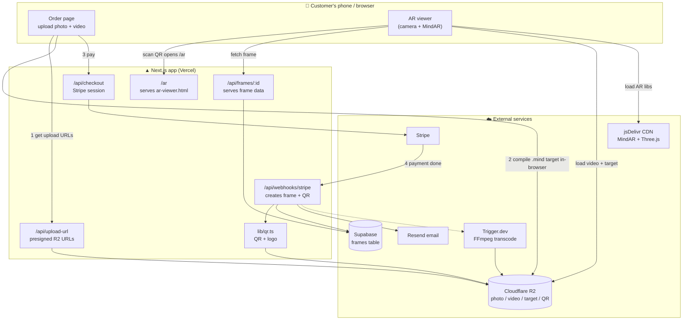

# The Golden Frame — Architecture & Risk Overview

_Last updated: 2026-07-12_

This document explains **what the product does**, **how it's built**, **how the QR code is generated**, and **whether any open-source or vendor dependency could "shut down" on us** (prompted by the 8th Wall closure).

---

## 1. What the product does (in one paragraph)

A customer buys a **personalised AR photo frame**. They upload a **photo** and a **short video**. We turn the printed photo into an **augmented-reality trigger**: when someone points their phone camera at the printed photo, the video plays *over* the photo, so the picture appears to come alive. Each frame ships with a **QR code** that opens the AR experience — no app to install.

**Key fact:** the printed **photo itself** is what triggers the video (via image recognition). The **QR code is only the "address"** — it tells the phone *which* memory to load. Once loaded, pointing at the photo is what plays it.

---

## 2. Tech stack

| Layer | Technology | Hosted / Self-hosted | Type |
|---|---|---|---|
| Web framework | **Next.js 16** (App Router) + React 19 | Vercel | SaaS host |
| AR engine | **MindAR** (`mind-ar-js`) + **Three.js** | Self-hosted copy **and** jsDelivr CDN | **Open source (MIT)** |
| Database | **Supabase** (Postgres) | Supabase cloud | SaaS |
| Object storage | **Cloudflare R2** (S3-compatible) | Cloudflare | SaaS |
| Payments | **Stripe Checkout** | Stripe | SaaS |
| Background jobs | **Trigger.dev v4** (video transcode via FFmpeg) | Trigger.dev cloud | SaaS |
| Email | **Resend** | Resend | SaaS |
| Video rendering tooling | **Remotion** | Build-time | Open source |
| QR generation | **qrcode** + **sharp** (logo compositing) | Server-side | Open source |

> The **AR engine is the only piece doing the "magic," and it is open-source and self-hostable** — this is exactly why the 8th Wall shutdown does **not** affect us (see §7).

---

## 3. High-level architecture

---

## 4. Flow A — Order & creation (how a frame is made)

1. **Upload** — On the order page, the browser asks `/api/upload-url` ([app/api/upload-url/route.ts](app/api/upload-url/route.ts)) for **presigned R2 URLs**, then uploads the **photo** and **video** directly to Cloudflare R2. Keys look like `photos/<nanoid>.jpg`, `videos/<nanoid>.mp4`.
2. **Compile the AR target (in the browser)** — The photo is turned into a `.mind` image-fingerprint file using the self-hosted MindAR compiler ([app/upload/compile.ts](app/upload/compile.ts)), then uploaded to R2 as `targets/<nanoid>.mind`. **This runs entirely on the customer's device — no server cost.**
3. **Checkout** — The browser calls `/api/checkout` ([app/api/checkout/route.ts](app/api/checkout/route.ts)) with `photoKey`, `videoKey`, `targetKey` + contact/delivery info. It creates a **Stripe Checkout Session**, stashing all those keys in Stripe **metadata**, and redirects to Stripe. (Two products: physical **frame + delivery**, or **digital AR only**.)
4. **Payment confirmed** — Stripe fires `checkout.session.completed` → `/api/webhooks/stripe` ([app/api/webhooks/stripe/route.ts](app/api/webhooks/stripe/route.ts)):
   - Verifies the Stripe signature; **idempotent** (won't double-create on retries).
   - Generates a `frameId`, builds the AR URL `https://<host>/ar?frame=<frameId>`.
   - **Generates the QR code** (see §5), uploads it to R2 as `qr/<frameId>.png`.
   - **Inserts the frame row** into Supabase (`status: active`, `payment_status: paid`, the R2 URLs, `qr_url`).
   - Sends **customer confirmation** + **admin order notification** emails via Resend.
5. **Video transcode (background)** — A Trigger.dev task `transcode-video` ([trigger/transcode.ts](trigger/transcode.ts)) downloads the raw video, runs **FFmpeg** (H.264, 1080p, faststart, AAC) for broad device compatibility, uploads the result to R2, and flips `video_status → ready`. _(Triggered from the direct-create path in [app/api/frames/route.ts](app/api/frames/route.ts).)_

---

## 5. How the QR code is generated

Handled by [lib/qr.ts](lib/qr.ts) → `generateQRWithLogo(url)`:

1. **Encode the AR URL** — `QRCode.toDataURL(url, …)` with:
   - `width: 400`, `margin: 2`
   - **`errorCorrectionLevel: 'H'`** — highest redundancy, so the code still scans even with a logo covering the centre.
   - Black on white.
2. **Add the brand logo (optional)** — If `public/qr-logo.png` exists, **sharp** resizes it to 80×80 and composites it in the **centre** of the QR. If sharp or the logo is missing, it gracefully returns the plain QR.
3. **Return** both a `dataUrl` (for embedding in emails) and a `Buffer` (uploaded to R2 at `qr/<frameId>.png`).

The encoded URL is always `https://<host>/ar?frame=<frameId>`. Scanning it opens `/ar` ([app/ar/route.ts](app/ar/route.ts)), which serves `public/ar-viewer.html` — carrying the `?frame=` param through so the viewer knows which memory to load.

---

## 6. Flow B — Scan & AR playback

1. **Scan QR** → opens `https://thegoldenframe.com.au/ar?frame=<frameId>`.
2. `/ar` serves **[public/ar-viewer.html](public/ar-viewer.html)** (query param preserved).
3. The viewer fetches **`/api/frames/<frameId>`** ([app/api/frames/[id]/route.ts](app/api/frames/[id]/route.ts)) → returns `videoUrl`, `targetUrl`, `photoUrl` and increments `scan_count`.
4. It loads **MindAR + Three.js from jsDelivr CDN**, downloads the `.mind` target + video from R2, opens the camera.
5. **MindAR recognises the printed photo** (`onTargetFound`) → plays the video as a texture, anchored inside the printed frame (inset to 94% so edges never spill).
6. **Fallbacks (added 2026-07):** a **"Watch without camera"** button plays the video screen-locked (zero shake), and if the camera is denied or tracking fails, a **"Watch the video instead"** button appears automatically.

> The `.mind` target can also be served same-origin via `/api/target/:id` ([app/api/target/[id]/route.ts](app/api/target/[id]/route.ts)) to avoid CORS if needed.

### Data model — `frames` table (Supabase)

`frame_id` · `customer_email` · `customer_name` · `photo_url` · `video_url` · `target_url` · `qr_url` · `status` · `plan` · `payment_status` · `stripe_session_id` · `price_paid` · `video_status` · `scan_count` · `last_scanned` · `created_at`

---

## 7. Open-source risk: can our AR engine "shut down" like 8th Wall?

**Short answer: No.** The 8th Wall shutdown cannot happen to us, because of a fundamental difference:

| | **8th Wall** (the one that shut down) | **MindAR** (what we use) |
|---|---|---|
| Business model | Commercial, hosted **SaaS** (Niantic) | **Open source, MIT licence** |
| Where it runs | On the vendor's servers + licensed SDK | **Entirely on the user's device** |
| Can a company switch it off? | **Yes** — servers go dark, SDK stops | **No** — the code is a file in our repo |
| Recurring licence fee | Yes | None |
| Our copy | — | Self-hosted in [public/vendor/mind-ar/](public/vendor/mind-ar/) |

Because MindAR is **open source and we host our own copy**, no company can revoke it. Even if the original author abandoned the project tomorrow, **our downloaded copy keeps working**, and we could fork and maintain it ourselves.

### The honest caveat: "slow evolution," not "shutdown"

MindAR is a **small open-source project (largely one maintainer)**. The realistic risk is **not** disappearance — it's:
- Slower feature development vs. a funded commercial SDK.
- No paid support line.
- May eventually lag behind new browser/camera API changes.

**Mitigations (all in place):**
- ✅ We **self-host** the compiler, so no vendor dependency for target creation.
- ✅ MIT licence means we can **fork and patch** freely.
- ✅ **Done (2026-07-12):** the AR *viewer* now loads MindAR + Three.js from our **own `/vendor` origin**, not the jsDelivr CDN. Pinned copies of `three@0.132.2` (+ the `CSS3DRenderer` addon) and `mind-ar@1.2.2` live in [public/vendor/](public/vendor/), and the service worker ([public/ar-sw.js](public/ar-sw.js)) pre-caches them — so a live scan has **zero third-party-CDN dependency** and even works offline after first load.

---

## 8. The dependencies that *could* actually change on us

The real "vendor" risks are the **paid SaaS services** — not the open-source AR. None is likely to vanish overnight, but all are worth knowing:

| Service | Role | Shutdown risk | If it changed | Mitigation |
|---|---|---|---|---|
| **Cloudflare R2** | Stores photos/videos/targets/QRs | Very low | Assets unreachable | S3-compatible → portable to AWS S3/Backblaze |
| **Supabase** | Frames database | Low | Can't look up frames | Standard Postgres → exportable/portable |
| **Stripe** | Payments | Very low | Can't take orders | Industry standard; swappable checkout |
| **Trigger.dev** | Video transcode jobs | Medium | Videos not optimised (still play) | Non-critical; could self-run FFmpeg |
| **Resend** | Emails | Low | No confirmation emails | Swappable (Postmark/SES) |
| **Vercel** | App hosting | Low | Site down | Next.js portable to any Node host |
| ~~jsDelivr CDN~~ | ~~Serves AR libs at scan time~~ | — | **Resolved** | ✅ AR libs now self-hosted from `/vendor` (§7) |

---

## 9. Summary

- **We are not exposed to the 8th Wall problem.** Our AR runs on **open-source, self-hosted MindAR** — nobody can switch it off.
- The QR code is a **branded, logo-embedded PNG** encoding a per-frame AR URL; the **photo itself is the real trigger**.
- The genuine long-term risks are ordinary **SaaS-vendor** risks (all low and mitigable) plus one concrete hardening task: **self-host the AR runtime libraries** so live scans don't depend on a third-party CDN.

---

### Recommended next actions
1. ✅ **Done —** Self-hosted MindAR + Three.js for the viewer (removed the jsDelivr runtime dependency).
2. Keep the **pinned, backed-up copies** in [public/vendor/](public/vendor/) under version control (three@0.132.2, mind-ar@1.2.2) — do not silently upgrade without re-testing a real scan.
3. Revisit the **cloud-recognition ("no QR") upgrade** only with a self-hostable/portable approach, so we never re-introduce vendor-shutdown risk.
