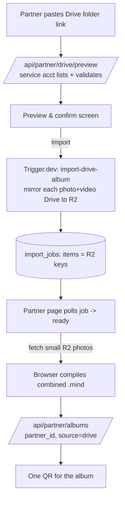

# Partner (B2B) module — gated album creation + Google Drive import

Status: **Phase 1 + Phase 2 implemented** on `album-mode` branch (2026-08-01) — see
"Setup & testing" below. Builds on album mode (`album-mode-plan.md`). Drive import uses a
**service account + shared folder** (not per-partner OAuth). ZIP fallback is browser-side.

## Goal

A login-gated area for B2B partners to create AR **albums** (one QR, many photo+video pairs):

1. **Manual builder** — partner uploads each photo + video pair and creates an album.
2. **Google Drive import** — the customer drops files into a structured Drive folder and shares
   it with our import service account; the partner logs in, points at the folder, and we pull the
   pairs in automatically.

## Non-negotiable: no impact on existing flows

Everything here is **purely additive**. The B2C order/upload/checkout/Stripe-webhook path, the
existing `/account` area, and the AR viewer are **not modified**:

- New tables/columns are all nullable/new (`partners`, `frames.partner_id`, `frames.source`).
- New routes only: `/partners/*` (pages), `/api/partner/*` (APIs), one new Trigger.dev task,
  one new `lib/google-drive.ts`.
- The AR viewer already renders albums generically (`plan='album'`) — **no viewer change**.
- Album creation reuses the album mode that's already tested; partner albums just carry a
  `partner_id` and `source`.

Rule of thumb: if a change would touch `app/api/frames/route.ts` (B2C create),
`app/api/webhooks/*`, `app/upload/*`, or checkout — it doesn't belong in this module.

## Auth & partner model (reuse what exists)

You already run **Supabase Auth** (magic link + optional Google sign-in) with
`createServerSupabase()`. Reuse it — do **not** build a second auth system.

- A user is a **partner** iff a row exists for them in a new `partners` table (keyed to their
  Supabase `auth.users.id`). Onboarding v1 = an admin inserts the row (a partner-admin UI is
  later). Everyone else (B2C customers) is unaffected and never sees `/partners`.
- `/partners/*` is gated in `app/partners/layout.tsx`: read the session; if no session →
  `/account/login`; if session but no `partners` row → a "not a partner / request access" page.

## Data model (migration — additive only)

```sql
-- Partners (one row per B2B login).
create table if not exists public.partners (
  id         uuid primary key references auth.users(id) on delete cascade,
  email      text not null,
  company    text,
  status     text not null default 'active',
  created_at timestamptz not null default now()
);

-- Ownership + provenance on the existing frames table (albums are frames rows).
alter table public.frames add column if not exists partner_id uuid references public.partners(id);
alter table public.frames add column if not exists source     text;  -- 'manual' | 'drive' | 'zip'
create index if not exists frames_partner_id_idx on public.frames(partner_id);

-- Import jobs (Drive mirror progress; polled by the partner UI).
create table if not exists public.import_jobs (
  id          uuid primary key default gen_random_uuid(),
  partner_id  uuid not null references public.partners(id),
  source      text not null,            -- 'drive'
  folder_ref  text,                     -- Drive folder id
  status      text not null default 'pending', -- pending|mirroring|ready|creating|done|error
  items       jsonb,                    -- [{photoKey, videoKey, name}]
  error       text,
  frame_id    text,                     -- set when the album is created
  created_at  timestamptz not null default now(),
  updated_at  timestamptz not null default now()
);

-- RLS: partners see only their own albums/jobs (existing public read policy on frames stays,
-- so the viewer still works). Partner writes go through session-verified API routes.
alter table public.partners  enable row level security;
alter table public.import_jobs enable row level security;
create policy "partner reads self"        on public.partners    for select using (id = auth.uid());
create policy "partner reads own jobs"    on public.import_jobs for select using (partner_id = auth.uid());
```

Existing `frames` rows have `partner_id = NULL` → untouched. B2C reads keep working.

## Phase 1 — Partner module + gated manual builder

Essentially the tested `/album` builder, moved behind partner auth and scoped to the partner.

- `app/partners/layout.tsx` — session + partner gate (as above).
- `app/partners/page.tsx` — dashboard: the partner's albums (frames where `partner_id = me`),
  each with its QR, scan count, and a link to the AR viewer.
- `app/partners/albums/new/page.tsx` — manual album builder (reuses `compileImageTargets` +
  R2 upload; posts to the partner album API).
- `app/api/partner/albums/route.ts` — like `/api/albums`, but: verify the session is a partner,
  set `partner_id` from the session (never from the client), `source='manual'`.
- `lib/partner.ts` — `getPartner()` helper (session → partner row | null).

No Drive yet. Low risk, immediately useful, and it establishes the ownership + gating that
Phase 2 relies on.

## Phase 2 — Import: Google Drive (service account) + ZIP fallback

Drive and ZIP share the **same mirror → browser-compile → create** pipeline; they differ only in
the *source* step (Drive service account vs. an uploaded `.zip` unpacked server-side, expecting
the identical folder layout). Build Drive first, then add ZIP as a second source into the same
Trigger task and preview screen.

### Folder convention (customer-facing)

```
<event folder>              ← the partner points us at THIS folder
├── folder1/   photo + video   ← one album item
├── folder2/   photo + video
└── folder3/   photo + video
```

- One image + one video per **leaf subfolder** = one album item. Subfolder-per-item makes
  pairing unambiguous (no filename matching).
- Items are ordered by **natural sort** of subfolder name (`folder2` before `folder10`).
- Validation per subfolder: exactly one `image/*` and one `video/*`; otherwise flag it in the
  preview and refuse until fixed. Non-media files ignored (with a note).
- Album cap = `ALBUM_MAX_ITEMS` (10 for now, one-line configurable; MindAR practical limit —
  bigger `.mind` = slower load + more false matches).

### One-time setup (you, in Google Cloud — no OAuth verification needed)

1. Create/choose a GCP project; **enable the Google Drive API**.
2. Create a **Service Account**; generate a **JSON key**.
3. Note its email, e.g. `import@<project>.iam.gserviceaccount.com`.
4. **Customers share their event folder with that email** (Viewer). That's the entire "auth" —
   no per-partner Google login, and no Google restricted-scope app review.
5. Store creds as env (below). If customers use a **Shared Drive**, Drive calls must pass
   `supportsAllDrives`/`includeItemsFromAllDrives`.

Env: `GOOGLE_SERVICE_ACCOUNT_EMAIL`, `GOOGLE_SERVICE_ACCOUNT_PRIVATE_KEY` (or a base64
`GOOGLE_SERVICE_ACCOUNT_JSON`). Needed by the API routes **and** the Trigger task.

### Pipeline (respects the browser-only `.mind` compile)

The `.mind` compiler runs **only in the browser** (that's why `/album` compiles client-side).
Big videos must stay off the browser. So the import splits work:



1. **Preview** (`/api/partner/drive/preview`) — service account lists the folder, pairs
   subfolders, validates, returns the structure. Quick; no heavy transfer.
2. **Mirror** (Trigger.dev task `import-drive-album`, **not** an API route — Vercel function
   time/memory limits would choke on 10 large videos): stream each photo + video from Drive to
   R2, write progress + resulting keys to `import_jobs`.
3. **Compile** (browser): once the job is `ready`, the partner page fetches the small **R2
   photo** URLs (public + CORS), compiles the combined `.mind`, uploads the target.
4. **Create** (`/api/partner/albums`): reuse album creation with the mirrored keys + target,
   `partner_id` from session, `source='drive'` → one QR.

### Phase 2 files

- `lib/google-drive.ts` — service-account Drive v3 client: `listAlbumFolder(folderId)` (paginated,
  shared-drive aware), pair detection, `downloadFile(fileId) → stream`.
- `app/api/partner/drive/preview/route.ts` — parse + validate a folder; return structure.
- `trigger/import-drive-album.ts` — mirror Drive → R2; update `import_jobs`.
- `app/api/partner/drive/import/route.ts` — create the job + trigger the task.
- `app/partners/albums/import/page.tsx` — paste link → preview → import → poll → compile → QR.

## Phase 2 — setup & testing (as built)

**What shipped:** partner portal is brand-themed (dark green/cream/gold). Dashboard has
**+ New album** (manual) and **Import (Drive / ZIP)**. The import page (`/partners/albums/import`)
has two tabs:
- **Google Drive** — paste a shared folder link → **Preview** (lists + validates each subfolder's
  photo/video) → **Import** → a Trigger.dev task mirrors Drive→R2 → the browser compiles the
  `.mind` and creates the album → one QR.
- **ZIP** — upload a `.zip` of the same folder tree; it's unpacked in the browser (JSZip), then
  compiled + created. No Google/Trigger needed. Best for smaller albums (the zip loads into
  browser memory).

**Migration (run once, Supabase SQL):**
```sql
CREATE TABLE IF NOT EXISTS public.import_jobs (
  id UUID PRIMARY KEY DEFAULT gen_random_uuid(),
  partner_id UUID NOT NULL REFERENCES public.partners(id),
  source TEXT NOT NULL, folder_ref TEXT, album_name TEXT,
  status TEXT NOT NULL DEFAULT 'pending', items JSONB, error TEXT, frame_id TEXT,
  created_at TIMESTAMPTZ NOT NULL DEFAULT now(), updated_at TIMESTAMPTZ NOT NULL DEFAULT now()
);
ALTER TABLE public.import_jobs ENABLE ROW LEVEL SECURITY;
DROP POLICY IF EXISTS "partner reads own jobs" ON public.import_jobs;
CREATE POLICY "partner reads own jobs" ON public.import_jobs FOR SELECT USING (partner_id = auth.uid());
```

> Policies have no `CREATE ... IF NOT EXISTS`, so re-running plain `CREATE POLICY` errors with
> "already exists". The `DROP POLICY IF EXISTS` guard above makes the whole block idempotent.

**Google Cloud (one-time, for Drive import only — ZIP works without it):**
1. Create/choose a GCP project → **enable the Google Drive API**.
2. Create a **Service Account** → **Keys → Add key → JSON**. Note its email
   (`…@<project>.iam.gserviceaccount.com`).
3. **Env vars** (Vercel **and** Trigger.dev, since the task also needs them):
   - `GOOGLE_SERVICE_ACCOUNT_EMAIL` = the SA email
   - `GOOGLE_SERVICE_ACCOUNT_PRIVATE_KEY` = the JSON key's `private_key` (paste with real newlines
     or literal `\n` — both handled).
4. The customer **shares their event folder with the SA email** (Viewer). Shared Drives work too
   (calls pass `supportsAllDrives`).

**To test:**
- **ZIP path (no setup):** zip a folder like `event/folder1/{photo,video}`, `folder2/{…}` → sign in
  as a partner → Import → ZIP tab → choose the zip → preview → create → scan the QR.
- **Drive path:** set the env vars, run **`npm run trigger:dev`** (the mirror runs there — without
  it the job stays pending and the import endpoint returns a clear "worker not available" error),
  share a structured folder with the SA email → Import → Drive tab → paste link → Preview →
  Import.

**Note on Trigger.dev:** the Drive mirror is a Trigger task on purpose (large videos would blow
Vercel's function limits). It must be running (`trigger:dev`) or deployed. ZIP has no such
dependency.

## Phase 3 — self-serve onboarding (IMPLEMENTED)

Replaces "admin-inserts-a-row" with **apply → admin approve → auto-activate → welcome email**.

**Flow:**
1. **Partners** tab on the landing nav → `/landing/partners` (pitch + "talk to us" + apply form).
2. Applicant submits name/email/mobile/city/company → `POST /api/partner/apply` → row in
   `partner_requests` (status `pending`) → **admin email** (to `ADMIN_EMAIL`) with a link to the
   approvals page. Applicant sees "Partner request sent."
3. Admin opens **`/admin/partners`** (gated to `ADMIN_EMAILS`/`ADMIN_EMAIL`) → **Approve**:
   creates the Supabase auth user (magic-link, no password) → upserts an **active** `partners`
   row → marks the request approved → **welcome email** to the partner with a sign-in link.
   **Reject** just marks it.
4. Partner clicks the email → magic-link login → lands in `/partners`.

**Security choice:** approve/reject happen on the gated admin page (requires an admin session),
not via raw tokenised links in the email (which can be forwarded or pre-fetched). The admin
email links you straight to the page.

**Migration (run once, Supabase SQL):**
```sql
CREATE TABLE IF NOT EXISTS public.partner_requests (
  id UUID PRIMARY KEY DEFAULT gen_random_uuid(),
  name TEXT NOT NULL, email TEXT NOT NULL, mobile TEXT, city TEXT, company TEXT, message TEXT,
  status TEXT NOT NULL DEFAULT 'pending', reviewed_at TIMESTAMPTZ, reviewed_by TEXT,
  created_at TIMESTAMPTZ NOT NULL DEFAULT now()
);
ALTER TABLE public.partner_requests ENABLE ROW LEVEL SECURITY; -- no policy = service-role only
ALTER TABLE public.partners ADD COLUMN IF NOT EXISTS name   TEXT;
ALTER TABLE public.partners ADD COLUMN IF NOT EXISTS mobile TEXT;
ALTER TABLE public.partners ADD COLUMN IF NOT EXISTS city   TEXT;
```

**Env:** `ADMIN_EMAIL` (already used for order notifications) gates the admin area and receives
application emails; optional `ADMIN_EMAILS` (comma-separated) for multiple admins. Emails use
the existing Resend config.

## Phase 3 — polish (later)

Partner dashboard niceties (search, scan analytics per album), re-import / idempotency (skip
already-mirrored files by Drive fileId), a partner-admin onboarding UI (replacing admin-inserts-
a-row), and per-partner branding on the QR/landing.

## Risks & mitigations

- **Vercel function limits on large media** → do all Drive→R2 transfer in the **Trigger.dev
  task**, never in a request handler. (Already in your stack.)
- **Google restricted-scope verification** → avoided entirely by the service-account model.
- **Large/slow video downloads** → stream (not buffer) Drive→R2; retry per file; job is
  resumable at the file level.
- **Malformed folders** (missing/extra photo or video) → validate in preview; block with a
  clear per-subfolder message before any transfer.
- **Idempotency / re-import** → key mirrored files by Drive `fileId`; a re-run skips files
  already in R2 for that job.
- **Security / ownership** → `partner_id` is always taken from the verified session, never the
  client; a partner can only import a folder shared with our SA and only sees their own albums
  (RLS). Consider recording which partner imported which folder for audit.
- **Service-account key management** → store the private key only in Vercel/Trigger secrets;
  rotate on leave; the SA can read only folders explicitly shared with it.
- **Storage cost** → importing duplicates Drive media into R2 (needed for the AR viewer + a
  stable URL). Acceptable; revisit lifecycle rules later.
- **Shared Drives** → set `supportsAllDrives`/`includeItemsFromAllDrives` or imports from a
  customer's Shared Drive return empty.

## Decisions (locked 2026-08-01)

- **Partner onboarding** → **admin-inserts-a-row** for v1 (no partner-admin UI yet). A user
  becomes a partner when an admin adds their row to `partners`.
- **Folder selection UX** → partner **pastes a Drive folder link/ID** (we extract the id).
- **Album cap** → **hard limit 10 for now, but a single config constant** so raising it is a
  one-line change, no logic rewrite. Put `ALBUM_MAX_ITEMS = 10` in one shared module
  (`lib/album-config.ts`) and reference it everywhere: the manual builder, `/api/albums`
  (currently a local `MAX_ITEMS` — switch it to the shared constant), the Drive preview, and the
  ZIP import. Raising the cap = edit that one line (plus a note that tracking quality/`.mind`
  size degrade past ~10).
- **ZIP fallback** → **build alongside Drive** in Phase 2 (helps customers not on Drive, and is
  a cheap Drive-free path that reuses the same mirror→compile→create pipeline).

## Does NOT touch

`app/api/frames/route.ts` (B2C create) · `app/api/webhooks/*` · `app/upload/*` · checkout ·
`public/ar-viewer.html` · the B2C `/account` area. Verified against the current code.
